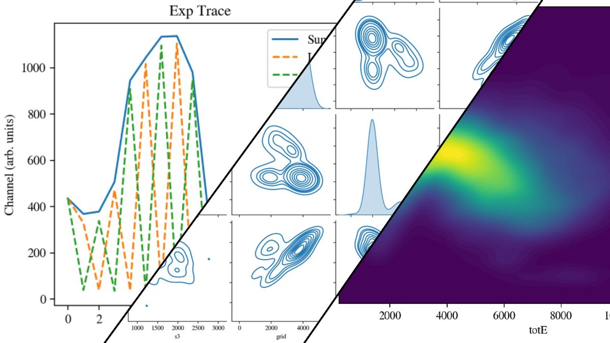

# MUSIC_with_python
[](https://www.python.org)
[](https://jupyterlab.readthedocs.io/en/stable)



A collection of example Python scripts and tutorials on using Python to analyze data from the ANL MUSIC detector.

WORK IN PROGRESS!

You can check out the first example notebook on binder

[](https://mybinder.org/v2/gh/dneto1729/MUSIC_with_python/main?labpath=examples%2F1+-+Looking+at+a+MUSIC+ROOT+data+file+with+uproot.ipynb)

## Requirements

The scripts here use several well-known Python packages (NumPy, SciPy, Pandas, sci-kit-learn, seaborn). To read/write ROOT files, you must install [uproot](https://pypi.org/project/uproot/). Since these experiment files are often quite large (several GB), anything saved after pulling from the ROOT container is done in the Apache Arrow format using [PyArrow](https://arrow.apache.org/docs/python/index.html), which can natively be read/write with Pandas. Finally, since it is always nice to have progress bars, some of these scripts use [tqdm](https://github.com/tqdm/tqdm), a lightweight package for progress bars. I have typically found installing packages the least painful with pip, but doing so after the initial environment setup through conda. An example of setting up the Python environment would be something like this.

```
conda create --name music_py python=3.8
conda activate music_py
```
Then install the standard Python packages with conda
```
conda install numpy scipy pandas matplotlib seaborn jupyter pip
```
Then use pip to install the rest
```
pip install uproot pyarrow tqdm
```
Of course, one could use only pip or conda for environment and package installation.

## Working with Uproot
Some of the examples here build off of the excellent [Uproot Tutorial](https://masonproffitt.github.io/uproot-tutorial/) by Mason Proffitt. For more info on uproot, you can look at the [uproot documentation](https://uproot.readthedocs.io/en/latest/index.html). 


## Argonne MUSIC Detector
For more information on the MUSIC detector, see [Nucl. Instrum. Meth. A 799, 197 (2015)](https://doi.org/10.1016/j.nima.2015.07.030) about the use of MUSIC with radioactive beams, and see [Nucl. Instrum. Meth. A 859, 63 (2017)](https://doi.org/10.1016/j.nima.2017.03.060) to learn more about the use of MUSIC to measure ($\alpha$,p) and ($\alpha$,n) reactions.

## FAQ

Q: Why use uproot instead of just using ROOT directly with PyROOT?

A: One could certainly install ROOT and, with PyROOT, do many of the same things (using functions from NumPy, SciPy, scikit-learn, etc...). However, you could then ask yourself, why use PyROOT to access some functions from NumPy when ROOT already has built-in stats and numerical analysis functions? First, it never hurts to have an alternative. Second, getting ROOT to run on Windows is always challenging; with uproot, you can open, read, and write ROOT files all within Python. Third, there are a ton of really cool Python packages that can do things "out of the box," which, in many cases, you would have to build from scratch to replicate with ROOT or C++.  

Q: Why should I use Python instead of the standard particle physics code ROOT?

A: There is no difference in analyzing experimental data with ROOT or Python. At the end of the day, you want to get some measurable (cross section, mass, charge, yield, etc...) choice of code should not matter. I prefer Python; most other people work with ROOT. If you want to see an example of some very nice ROOT scripts to analyze MUSIC data, see [MUSIC_CoMPASS_softwares](https://github.com/CFougeres/MUSIC_CoMPASS_softwares).

Q: Why did you write these as "simple" scripts? Why not a library or something more like a package?

A: I would not claim the code here is perfect or even optimal. This should be treated as a set of minimal viable beta scripts. I do plan to refactor these into a nicer format at some point. But, for the moment, these are here to give an idea of how to work with MUSIC data using Python.
