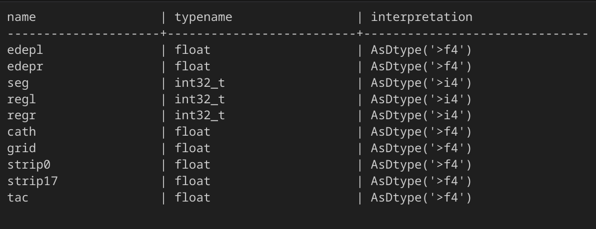
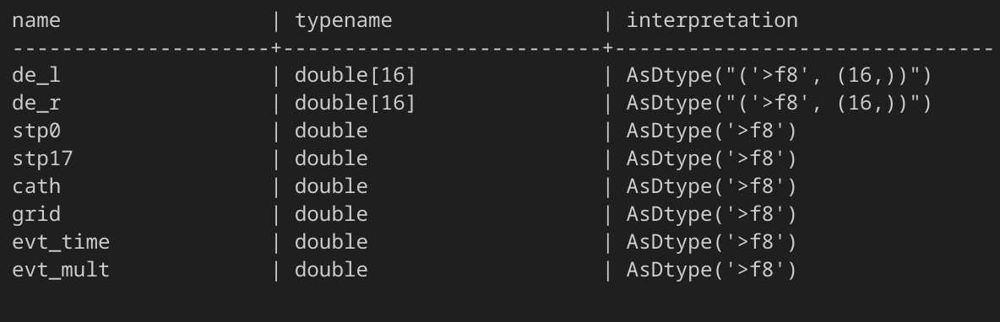
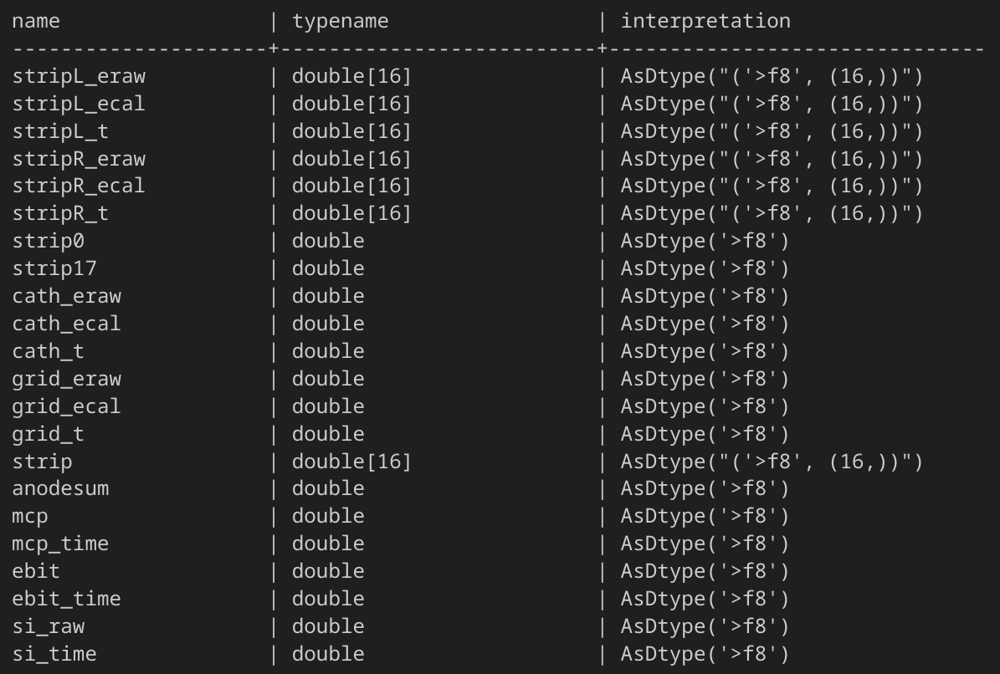
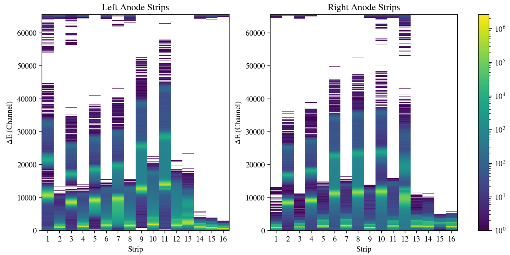

# Some Quick Notes on Working with MUSIC Data from other DAQs

The notebooks and scripts in this repository have been set up to use the older style analog DAQ MUSIC ROOT files. However, once you convert from ROOT to feather/csv, the bulk of the tutorials remain the same (everything is read/manipulate within a pandas dataframe or numpy array). So, here we provide a summary of building a feather file from ROOT files generated using three different DAQs that MUSIC experiments have used. 

## ANL Analog MUSIC DAQ (SCARLET, etc...)

Example Analog ROOT tree structure



In some sense, these ROOT files have the simplest data structure. Strip 0, 17, and the Grid are all on their own branch. The left and right segments of the middle anode are also on their own branches. However, everything is stored in simple 1D arrays. This then has the quirk where each event corresponds to a set of 16 elements from each array. For example, the first event is given by rows 0 - 15 of each branch. This means some branches then have a single value repeated 16 times (such as strip0) while 'edepl' for example has 16 unique values corresponding to the $\Delta$E of strip 1L then 2L then 3L etc...

To make things a little easier to work with we can use the seg branch to help us in creating a more structured dataframe. The seg branch simply contains a looping list of 1 - 16 (e.g. 1, 2, 3, 4, 5, 6, 7, 8, 9, 10, 11, 12, 13, 14, 15, 16, 1, 2, 3, ...). One example of building a dictionary to then construct a dataframe, could look something like this

```python
branches = tree.arrays() # build branches as arrays

dict_branches = {}

# strip0 first
dict_branches.update({'s0':branches['strip0'][branches['seg'] == 1]})
# segmented anode, left first then right
for i in range(1,17):
    dict_branches.update({f's{i}L':branches['edepl'][branches['seg'] == i]})
    dict_branches.update({f's{i}R':branches['edepr'][branches['seg'] == i]})
# strip17
dict_branches.update({'s17':branches['strip17'][branches['seg'] == 1]})
# grid last
dict_branches.update({'grid':branches['grid'][branches['seg'] == 1]})

# DataFrame from dictionary
df = pd.DataFrame(dict_branches)

```

## ANL Digital MUSIC DAQ (CAEN/COMPASS at ANL)

Example Digital ROOT tree structure



For experiments using the current (2023-ish) CAEN setup for MUSIC, after event reconstruction we can see the ROOT structure is very similar to that from the analog DAQ but now the segmented anode is stored as a 2D array (or rather, an array where each element is itself 1D array with 16 elements). If we want to convert this to a dataframe using a dictionary we can modify the code we used in the analog DAQ example. First, we no longer need to use a cut (like we did using the 'seg' branch in the analog case) so strip 0, strip 17 and grid can just be pulled. Second, for the segmented anode, all we need to do is manipulate 'de_l' and 'de_r' just like an array.

```python
branches = tree.arrays() # build branches as arrays

dict_branches = {}

# strip0 first
dict_branches.update({'s0':branches['stp0']})
# segmented anode, left first then right
for i in range(0,16):
    dict_branches.update({f's{i+1}L':branches['de_l'][:,i]})
    dict_branches.update({f's{i+1}R':branches['de_r'][:,i]})
# strip17
dict_branches.update({'s17':branches['stp17']})
# grid last
dict_branches.update({'grid':branches['grid']})

# DataFrame from dictionary
df = pd.DataFrame(dict_branches)

```

## MUSIC at FRIB using FRIB DAQ

Example FRIB DAQ ROOT tree structure



During both of the 2024 MUSIC experiments at FRIB, the MUSIC detector was connected to an FRIB DAQ. After event reconstruction, the ROOT files had the above structure. The first thing that jumps out is there are a lot more branches. This is more a quirk of these experiments (that is to say, this is just how the experimenters wanted the structure to be). But, we can see some things that look similar to the previous digital DAQ example. That is strip 0 and strip 17 are just simple 1D arrays, and the segmented anode is split into a left and right array (where each element is itself a 1D array of 16 elements). So, some minor edits to the last example gives us some code to bring this ROOT data into a dataframe. Just for the sake of this example, I will pull the raw energy loss values 'eraw'.


```python
branches = tree.arrays() # build branches as arrays

dict_branches = {}

# strip0 first
dict_branches.update({'s0':branches['strip0']})
# segmented anode, left first then right
for i in range(0,16):
    dict_branches.update({f's{i+1}L':branches['stripL_eraw'][:,i]})
    dict_branches.update({f's{i+1}R':branches['stripR_eraw'][:,i]})
# strip17
dict_branches.update({'s17':branches['strip17']})
# grid last
dict_branches.update({'grid':branches['grid_eraw']})

# DataFrame from dictionary
df = pd.DataFrame(dict_branches)

```

### Brief Aside: A 'seg' branch for quick plotting with digital DAQ

With the analog DAQ, having the 'seg' branch makes certain plots easier to do. That is if you just want to make a quick plot using the awkward arrays themselves before you build a dataframe or convert to a feather file, that 'seg' branch was nice to have. Creating an array to perform the same purpose is very easy using some numpy functions. One way is to just build an array with a similar structure to the 'edepl/edepr' or 'stripL/stripR' branches but where each element is an array like [1,2,3,...,16]. Then using the numpy tile function we can create something that has the same length as the other branches. So, for the FRIB DAQ example, we could do something like

```python
mid_anode = np.array([np.arange(1,17,1)])
seg = np.tile(mid.anode, (len(branches['grid_eraw']), 1))

```

Then for example, if we wanted to plot a left and right segmented anode histogram from the FRIB DAQ ROOT file we could do something like

```python
import awkward as ak


fig, (axL,axR) = plt.subplots(1,2, layout='compressed')
#
axL.set_title('Left Anode Strips')
left_anode = axL.hist2d(seg.flatten(), ak.to_numpy(branches['stripL_eraw']).flatten(),
                        bins=(np.arange(1,18),500),
                        norm=LogNorm())
axL.set_xticks(np.arange(1,17)+0.5,np.arange(1,17))
axR.set_title('Right Anode Strips')
right_anode = axR.hist2d(seg.flatten(), ak.to_numpy(branches['stripR_eraw']).flatten(),
                         bins=(np.arange(1,18),500),
                         norm=LogNorm())
axR.set_xticks(np.arange(1,17)+0.5,np.arange(1,17))
# colorbar
cbar = plt.colorbar(right_anode[3], ax=(axL,axR)) # 

for axes in (axL,axR):
    axes.set_xlabel('Strip')
    axes.set_ylabel(r'$\Delta$E (Channel)')

plt.show()
```




```python

```
